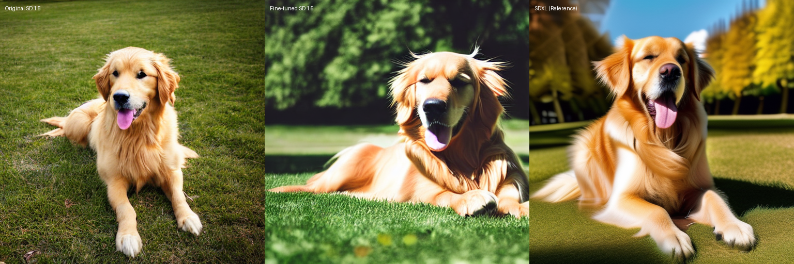
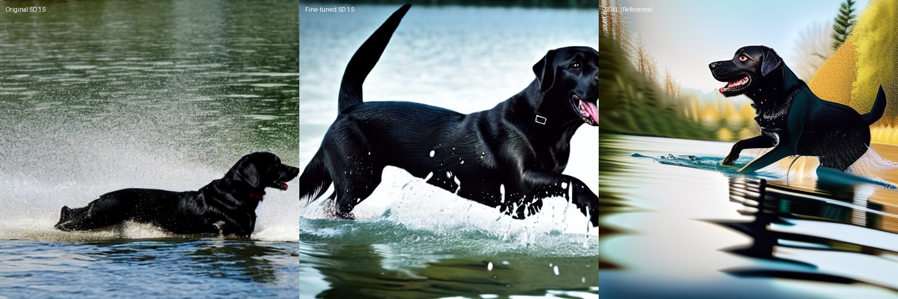
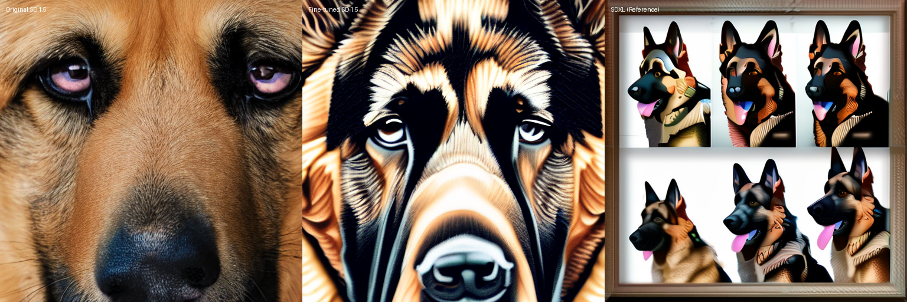

# Knowledge Transfer in Image Generation Models: Research Summary

*Generated on 2025-04-21 15:48*

## Experiment Configuration

| Parameter | Value |
|-----------|-------|
| Base Model | Stable Diffusion 1.5 |
| Teacher Model | Stable Diffusion XL |
| Fine-tuning Method | LoRA (Low-Rank Adaptation) |
| LoRA Rank | 16 |
| LoRA Alpha | 32 |
| Image Size | 512x512 |
| Inference Steps | 50 |
| Training Time | 0h 4m |

## Key Findings

### Overall Improvements

After fine-tuning the Stable Diffusion 1.5 model using LoRA with images generated by SDXL as reference, the following improvements were observed:

| Metric | Improvement |
|--------|------------|
| Structural Similarity (SSIM) | 5.72% increase |
| Mean Squared Error (MSE) | 0.51% increase |
| Histogram Similarity | 13.07% decrease |
| Perceptual Hash Similarity | 3.88% decrease |
| Color Distribution Similarity | 0.08% increase |

### Category-Specific Findings

#### Standard Images

The fine-tuned model showed mixed results with improvements in some metrics and decreased performance in others.

#### Challenging Images

The fine-tuned model showed significant improvements in ssim (29.0%) and hist_similarity (24.0%) compared to the original model.

#### Closeup Images

The fine-tuned model showed mixed results with improvements in some metrics and decreased performance in others.

## Conclusion

The experiments show mixed results for knowledge transfer from SDXL to SD 1.5 using LoRA fine-tuning. While some specific cases showed improvement, the overall performance suggests that alternative approaches or hyperparameter configurations should be explored.

### Future Work

1. Explore different LoRA configurations (rank, alpha, target modules)
2. Test with a wider variety of image types and prompts
3. Investigate the impact of training duration on improvement metrics
4. Compare with other fine-tuning methods beyond LoRA
5. Conduct user studies to evaluate perceived image quality improvements
